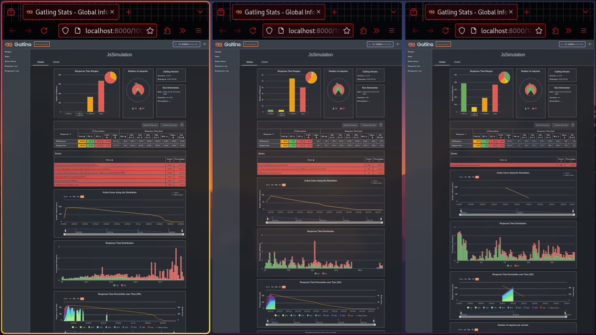

# Steps to reproduce

## Create Table

```bash
docker exec -i <postgres_container_id> psql -U postgres -d auth_db < create_table.sql
```

## Create Mock Data

```bash
cd mock
node mock_create.js
```

## Setup Server

```bash
npm install
node src/server.js
```

## Run tests

In order to change number of users, change the `n` in the test.

```js

const options = [
  { filename: "mock/mock_data_1000.csv", number: 1000 },
  { filename: "mock/mock_data_10000.csv", number: 10000 },
  { filename: "mock/mock_data_100000.csv", number: 100000 },
];

const n = 0; // change this to get other numbers

```

and then run it parallely to the server.

```bash
npx gatling run
```

it will output Result in html.

# Results

Results can be found in `reports` folder.


