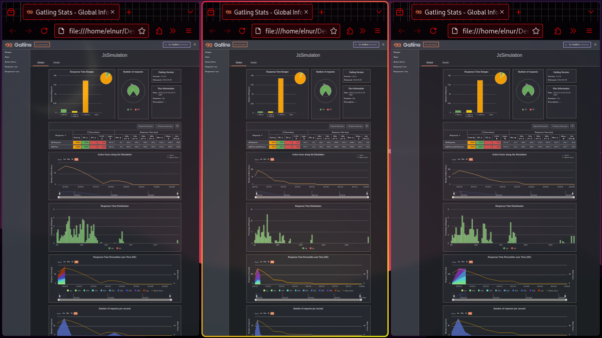

# Setup and Run Tests

## Setup

### PG DB

```bash
cd pg
docker compose up -d
docker exec -i <postgres_container_id> psql -U postgres -d the_db < create.sql
```

### Dependencies

```bash
npm i
```

### Mock Data

```bash
cd mock
node mock_create.js
```

## Run test

```bash
# in one terminal
node server.js 

# in another run tests, as they should run in parallel
npx gatling run --simulation post && \
npx gatling run --simulation postandref && \
npx gatling run --simulation postwithref
```

## Auto Setup and Run

```bash
bash setupnrun.sh
```

## Result



More about results is in [text](reports/load_test_results_2_10000.md)
