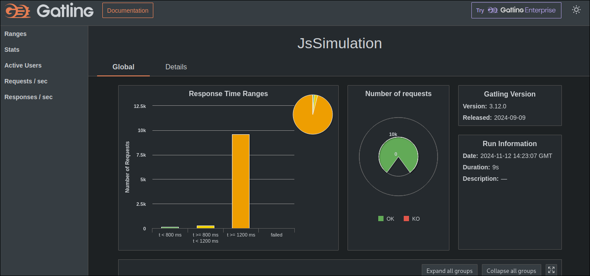
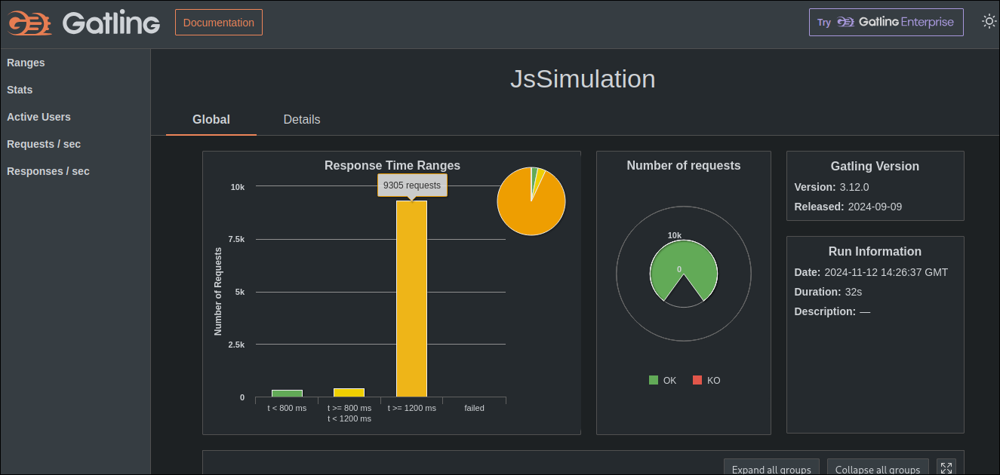

## Gatling Test Report Summary

### Simulation 1: `updatebyid`

- **Total Requests**: 10,000
- **Successful Requests**: 10,000 (100%)
- **Failed Requests**: 0 (0%)
- **Min Response Time**: 95 ms
- **Max Response Time**: 9,495 ms
- **Mean Response Time**: 3,125 ms
- **Standard Deviation**: 1,715 ms
- **Percentiles**:
  - 50th Percentile: 2,986 ms
  - 75th Percentile: 4,447 ms
  - 95th Percentile: 5,847 ms
  - 99th Percentile: 7,319 ms
- **Requests per Second**: 909.09

### Simulation 2: `updatebyname`

- **Total Requests**: 10,000
- **Successful Requests**: 10,000 (100%)
- **Failed Requests**: 0 (0%)
- **Min Response Time**: 156 ms
- **Max Response Time**: 9,794 ms
- **Mean Response Time**: 3,548 ms
- **Standard Deviation**: 1,980 ms
- **Percentiles**:
  - 50th Percentile: 3,340 ms
  - 75th Percentile: 4,483 ms
  - 95th Percentile: 7,221 ms
  - 99th Percentile: 9,780 ms
- **Requests per Second**: 909.09

### Observations

- Both simulations completed with no failed requests.
- `updatebyname` had a higher mean response time (3,548 ms) compared to `updatebyid` (3,125 ms).
- `updatebyname` had a wider range of response times with higher max and 99th percentile values.
- So, to my mind - byid performs better
## Gatling Reports

Those can be found in `target/gatling/`, in `byid` and `byname` folder:

