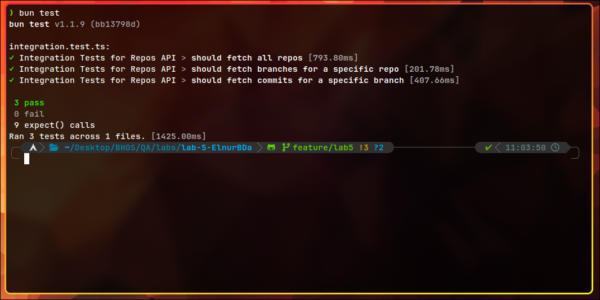

# Integration Tests for Repos API

The tests were written using `bun:test` and `zod` for schema validation.

## Learning Outputs

- **Test Framework**: I used `bun:test` (`describe`, `it`, `expect`) to structure and run the tests.
- **Schema Validation**: I used `zod` to validate the API responses against predefined schemas for repositories, branches, and commits.
- **API Structure**: Each API endpoint was tested for:
  - Status code validation (ensuring a `200` status).
  - Array checks to ensure the data is returned in a list format.
  - Schema validation to confirm the data matches the expected structure.

## Setup

### Requirements

- Install necessary dependencies:

  ```bash
  bun install
  ```

### Running the Integration Tests

1. Run the following command to execute the tests:

   ```bash
   bun run test
   ```

2. After the tests are complete, the results will display in the terminal, showing a success message if all tests pass. You will see output similar to this:

