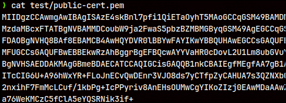
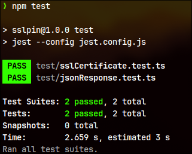

[](https://classroom.github.com/a/GxpM--EJ)

# Guidelines

## To get Cert and Fingerprint

```bash
# To get public cert
openssl s_client -showcerts -connect 60a21d3f745cd70017576092.mockapi.io:443 </dev/null 2>/dev/null | openssl x509 -outform PEM > public-cert.pem
# to get fingerprint
openssl x509 -noout -in public-cert.pem  -fingerprint
SHA1 Fingerprint=03:35:A3:9B:C7:90:DE:07:DB:88:1C:5F:30:82:33:96:13:FF:AC:95
```

Then you need to change the file to have all base64 part in one line.


## Run the tests

```bash
npm test
```



# How certificate is verified?
- there is a local copy of certificate
- then we get a certificate from the api in test, and just match them
