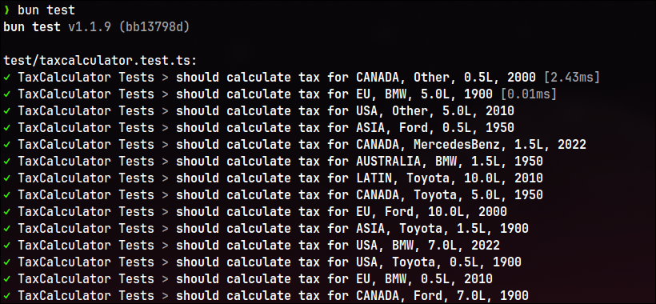
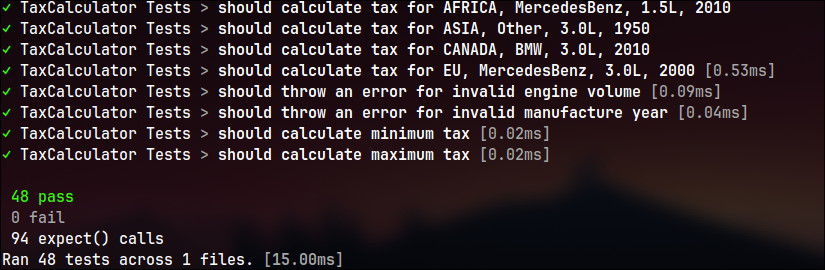

[](https://classroom.github.com/a/v__6qPOC)

# In order To generate

- <https://pairwise.yuuniworks.com/>

`input`

```
Country:        USA, CANADA, LATIN, EU, ASIA, AFRICA, AUSTRALIA
Manufacturer:   MercedesBenz, BMW, Ford, Toyota, Other
EngineVolume:   0.5, 1.5, 3.0, 5.0, 7.0, 10.0
ManufactureYear: 1900, 1950, 2000, 2010, 2022

if [Manufacturer] = "MercedesBenz" then [EngineVolume] >= 1.5;
```

`output`

```
Country Manufacturer EngineVolume ManufactureYear
CANADA Other 0.5 2000
EU BMW 5.0 1900
USA Other 5.0 2010
ASIA Ford 0.5 1950
CANADA MercedesBenz 1.5 2022
AUSTRALIA BMW 1.5 1950
LATIN Toyota 10.0 2010
CANADA Toyota 5.0 1950
EU Ford 10.0 2000
ASIA Toyota 1.5 1900
USA BMW 7.0 2022
USA Toyota 0.5 1900
EU BMW 0.5 2010
CANADA Ford 7.0 1900
LATIN BMW 1.5 2000
AUSTRALIA Other 3.0 2022
LATIN Ford 0.5 2022
ASIA MercedesBenz 7.0 2010
CANADA BMW 10.0 1900
AFRICA Toyota 7.0 2000
AFRICA Other 10.0 1950
USA MercedesBenz 10.0 1950
AUSTRALIA MercedesBenz 5.0 2000
ASIA Toyota 10.0 2022
AFRICA BMW 0.5 1900
AFRICA Ford 5.0 2022
LATIN Other 5.0 1900
AUSTRALIA Ford 10.0 1900
AUSTRALIA Ford 0.5 2010
AFRICA MercedesBenz 3.0 2010
USA Ford 1.5 2010
ASIA BMW 5.0 2000
AUSTRALIA Toyota 7.0 1950
LATIN MercedesBenz 3.0 1950
CANADA MercedesBenz 3.0 1900
EU Toyota 3.0 2022
EU Other 7.0 1950
LATIN Other 7.0 1900
EU Other 1.5 2022
USA Ford 3.0 2000
AFRICA MercedesBenz 1.5 2010
ASIA Other 3.0 1950
CANADA BMW 3.0 2010
EU MercedesBenz 3.0 2000
```

Then, in `vim`: `:%s/<tab>/,/g` to replace all tabs with `,`.
Then, csv to JSON: `cat output.csv | python -c 'import csv, json, sys; print(json.dumps([dict(r) for r in csv.DictReader(sys.stdin)]))' | jq > output.json`

# Test

```bash
bun test
```

> 
> 

# Justification

Pairwise testing was chosen because the number of possible combinations (7 × 5 × 3 × 3 = 315) is too large for exhaustive testing. Pairwise testing ensures that every possible pair of factor values is tested at least once, reducing the total number of test cases while still providing effective coverage.
